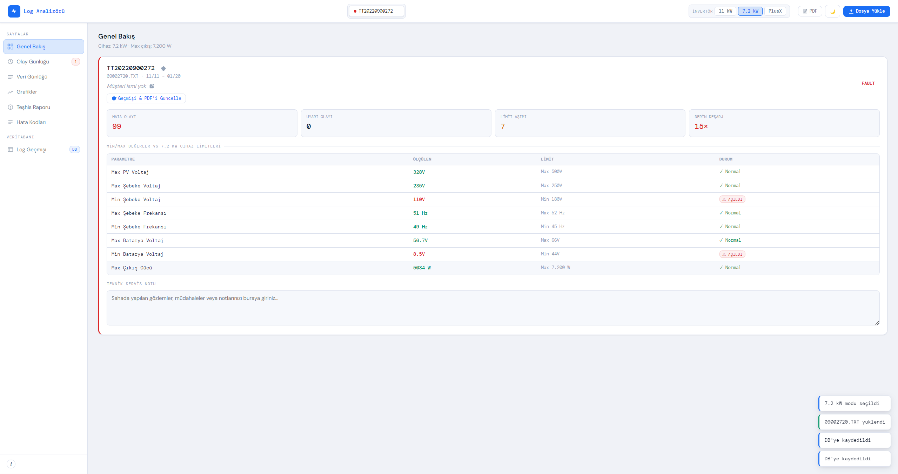
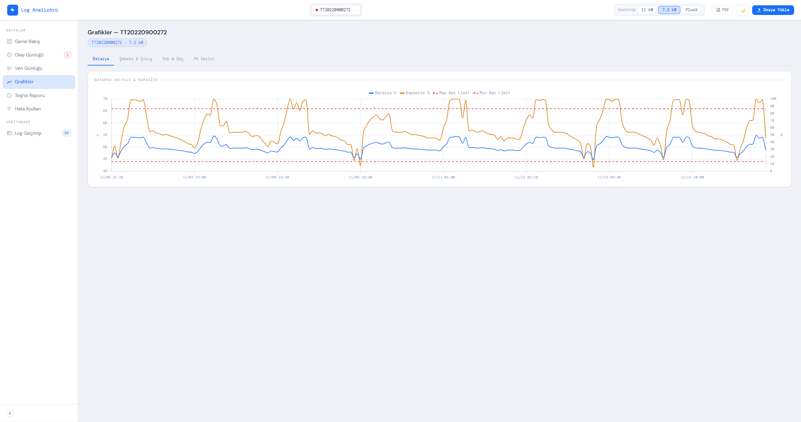
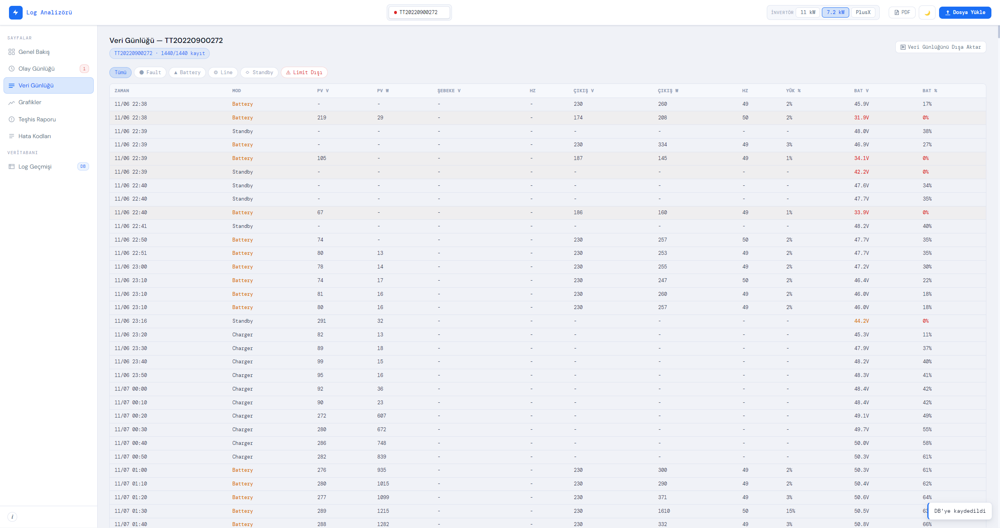
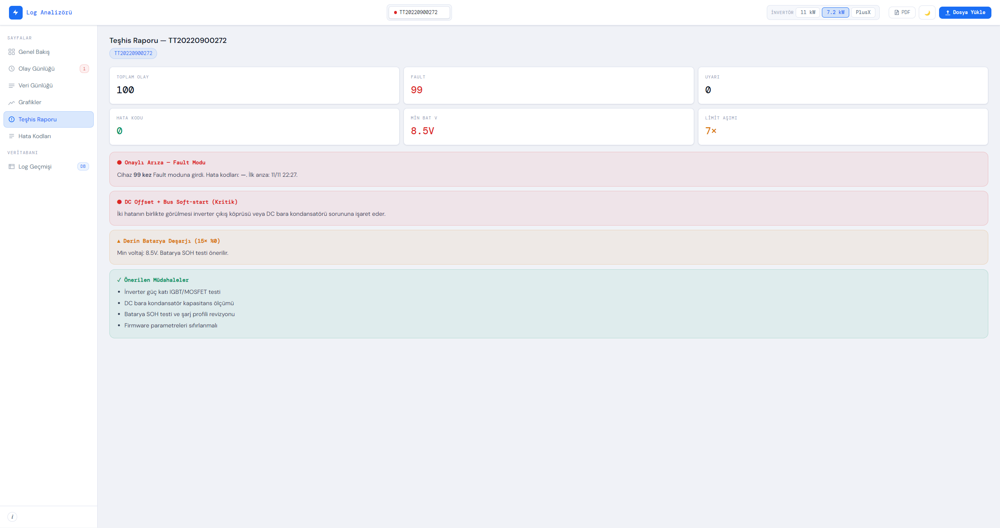

<div align="center">
  <h1>🔍 LogAnalyzer</h1>
  <p><i>Akıllı Arıza Teşhis ve Donanım Log Analizi Sistemi</i></p>
</div>

<br/>
<div align="center">
  
  
  
  
</div>

---

## 1. Yönetici Özeti (Executive Summary)

**LogAnalyzer**, donanım cihazlarından ve gömülü sistemlerden elde edilen geçmiş ham log verilerini eyleme dönüştürülebilir operasyonel zekaya çeviren gelişmiş bir analiz ve arıza teşhis platformudur. Teknik servis ortamlarında karşılaşılan zaman alıcı manuel log inceleme süreçlerini tamamen dijitalleştirmek üzere tasarlanan bu sistem; büyük hacimli logları hızla ayrıştırır, metrikleri interaktif grafiklere dönüştürür ve bulguları ilişkisel bir veritabanında kalıcı olarak indeksler. Cihaz arıza kök nedeninin (Root Cause) saniyeler içinde tespit edilmesini sağlayan bu analitik mimari, MTTR (Mean Time To Repair - Ortalama Onarım Süresi) oranlarını dramatik ölçüde düşürmektedir. Geliştirilen bu sistem, aktif olarak teknik servis birimi üretim (production) ortamında vizyoner bir çözüm olarak günlük operasyonların merkezinde kullanılmaktadır.

## 2. Sektörel Değer ve Öne Çıkan Özellikler

Endüstriyel bakım, telekomünikasyon ve savunma/enerji sektörü donanım süreçleri için kritik bir katma değer sunan bu proje, aşağıdaki mühendislik yetkinliklerini merkeze almaktadır:

- **Otonom Veri Ayrıştırma ve Hata Tespiti:** Yapılandırılmamış (unstructured) veya kısmen yapılandırılmış ham log dosyalarının milisaniyeler seviyesinde okunarak anlamlı arıza örüntülerine dönüştürülmesi.
- **Kapsamlı Raporlama ve İhracat (Export) Mimarisi:** Analiz sonuçlarının yöneticilere sunulmak üzere dinamik PDF raporlarına ve veri bilimi süreçleri için yapılandırılmış Excel matrislerine (.xlsx) anında dönüştürülmesi.
- **Kurumsal Hafıza ve Geriye Dönük İzlenebilirlik:** İncelenen donanımlara ait tüm teknik geçmişin ve hata telemetrilerinin merkezi/gömülü bir veritabanında arşivlenmesi; bu sayede seri numarası bazlı geriye dönük arıza sorgulamalarının yapılması.
- **Kanıtlanmış Saha Entegrasyonu:** Teorik bir prototipten öte, sahada çalışan teknisyenler tarafından aktif, yoğun olarak kullanılan; I/O darboğazlarına ve istisnai log formatlarına (Exception) karşı dayanıklılığı saha şartlarında test edilmiş bir sistem mimarisi.

## 3. Kullanılan Teknolojiler (Tech Stack)

Uygulamanın çekirdek mimarisi, yüksek performanslı metin işleme ve esnek arayüz prensiplerine sadık kalınarak tasarlanmıştır:

| Katman | Teknoloji / Çerçeve | Kullanım Amacı |
| :--- | :--- | :--- |
| **Çekirdek (Backend)** | Python / Node.js | Yüksek hacimli veri okuma/yazma yönetimi, Regex tabanlı data parsing ve iş mantığı. |
| **Arayüz (Frontend)** | Electron.js / PyQt | Platform bağımsız, kurumsal standartlara uygun duyarlı (responsive) masaüstü (Desktop) deneyimi. |
| **Veritabanı** | PostgreSQL / SQLite | Arıza geçmişinin, cihaz kayıtlarının ve PDF rapor indekslerinin güvenli asenkron depolanması. |
| **Görselleştirme** | Recharts / Matplotlib | Donanım telemetrilerinin ve loglardaki hata frekanslarının interaktif zaman serilerine dökülmesi. |
| **Raporlama Motoru** | PDFKit / ReportLab, OpenPyXL | Kurumsal formata uygun kurallı PDF çıktı otomasyonu ve log serilerinin Excel yapılandırması. |

## 4. Sistem Mimarisi ve İş Akışı (Workflow)

Sistem uçtan uca veri bütünlüğünü koruyan, kesintisiz bir veri boru hattı (Data Pipeline) olarak çalışır:

1. **Ingestion (Veri Kabulü):** Donanımdan çekilen terminal/hata dosyaları, okuma katmanı vasıtasıyla sisteme yüklenir.
2. **Parsing & Extraction (Ayrıştırma):** Optimize edilmiş Regex algoritmaları ve parser sınıfları devreye girerek on binlerce satırlık log verisindeki zaman damgalarını (Timestamp), kritik hata kodlarını (Fatal, Error, Warning) ve sensör okumalarını filtreler.
3. **Data Persistence (Veri Kaydı & İndeksleme):** Ayrıştırılan anlamlı veriler, cihaz barkodu standartlaştırılarak yerel/uzak veritabanına kaydedilir; operasyonel bir hafıza oluşturulur.
4. **Visualization & Execution (Analiz ve Önizleme):** Kritik veriler UI üzerinden anlık olarak interaktif dağılım ve ısı grafiklerine dönüştürülerek yöneticinin/mühendisin incelemesine sunulur. Hata lokalizasyonu saniyeler içinde gerçekleşir.
5. **Distribution (Derleme ve Çıktı):** İşlem neticesinde kullanıcının tetiklemesiyle tüm analiz safhaları sistematik bir PDF raporu halinde derlenir ve dileyen analistler için log katmanı Excel olarak bilgisayara ihraç edilir.

## 5. Kritik Mühendislik Noktaları

Geliştirme sürecinde üstesinden gelinen temel mühendislik bariyerleri ve mimari konseptler şunlardır:

- **Büyük Veri Yönetimi ve Bellek (RAM) Optimizasyonu:** Kurumsal cihazlardan çekilen çok büyük boyutlu (Gigabayt seviyesi) log dosyalarının çalışan RAM'i doyurmasını/tüketmesini önlemek için streaming/chunking okuma algoritmaları sisteme uyarlanmış, G/Ç (I/O) performansı maksimize edilmiştir.
- **Asenkron Veritabanı ve Çıktı Yönetimi:** CPU'yu meşgul eden uzun süreli PDF/Excel derleme işlemleri ile veritabanı iterasyonları asenkron mimaride (Event-loop / Multi-threading) tasarlanmış olup; UI donmalarının (Thread Blocking) önüne geçilmiştir.
- **Agnostik ve Dinamik Veri Şeması:** Gelecekte sisteme dahil edilecek farklı üreticilerin farklı log formatlarına (düzensiz anomaliler) dahi adapte olabilecek esneklikte hata yakalayıcı (try-catch/error-boundary) mekanizmalar inşa edilmiştir.

## 6. Proje Ağacı (Repository Structure)

```tree
LogAnalyzer/
├── src/
│   ├── core/
│   │   ├── parser_engine/       # Regex tabanlı modüler log ayrıştırma motoru
│   │   └── data_processor/      # Ham dataları ilişkisel modellerine (Dictionary/JSON) çeviren katman
│   ├── database/
│   │   ├── schema/              # DB Varlıkları (LogEntry, DeviceRecord, ReportLog) için modeller
│   │   └── db_connector/        # Asenkron veritabanı bağlantı havuzu yönetimi
│   ├── ui/
│   │   ├── components/          # Reusable parçalar (Grafik panelleri, Data Grid'ler)
│   │   └── views/               # Ana Kontrol Paneli (Dashboard), Geçmiş Analiz Gösterimi
│   ├── utils/
│   │   ├── report_generator/    # İş zekası (PDF ve XLSX algoritmik render sistemi)
│   │   └── error_handler/       # Sistem içi tanı (Internal diagnostics) ve istisna yönetimi
│   └── main_app                 # Programın yürütme (Entrypoint) katmanı
├── scripts/                     # Build, installer oluşturma (.exe/.dmg) otomasyon betikleri
├── docs/                        # Veri akış diyagramları ve mimari şemalar
└── README.md                    # Sistem vizyon manifestosu (Bu belge)
```

## 7. Gelecek Yol Haritası (Future Roadmap)

Uygulamanın sürdürülebilir büyümesi ve yüksek endüstri standartlarına taşınması için planlanan hedefler:

- **[ ] Yapay Zeka (AI) Destekli Kestirimci Bakım:** Geçmiş loglardaki kronik arıza desenlerini değerlendirerek henüz cihaz bozulmadan önce "Predictive Maintenance" anomali uyarıları üreten bir Makine Öğrenmesi (Örn: Isolation Forest) katmanı eklenecektir.
- **[ ] LLM Tabanlı Otonom Özetleme:** Karışık log sembollerini, terminal çıktılarını yerel (Local) bir Dil Modeli (LLM) ile analiz edip teknisyene direkt Türkçe/İngilizce raporlayan bir yapay zeka asistanı entegrasyonu.
- **[ ] Canlı (Real-Time) Hata Analiz Ağı:** Geçmiş verilerin incelenmesinin yanı sıra, cihaz seri veya ağ portundan canlı akan (stream) logların WebSocket ile izlenmesi; hata yaşandığı an ekiplere uçtan uca uyarı (Webhook Alert) yollanması.
- **[ ] Merkezi Kurumsal Data Lake Senkronizasyonu:** Farklı onarım istasyonlarındaki lokal verilerin bir merkezi bulut veri ambarına (Data Lake) düzenli gönderimi sağlanarak, şirket düzeyinde genişletilmiş üretim kalite kontrol analizleri yapılması.

---

> **Not:** Ticari/Akademik kısıtlamalar nedeniyle bu projenin kaynak kodları gizli bir depoda tutulmaktadır. Bu depo, sistemin mimari özetini ve teknik yetkinlikleri sergilemek amacıyla oluşturulmuştur.
